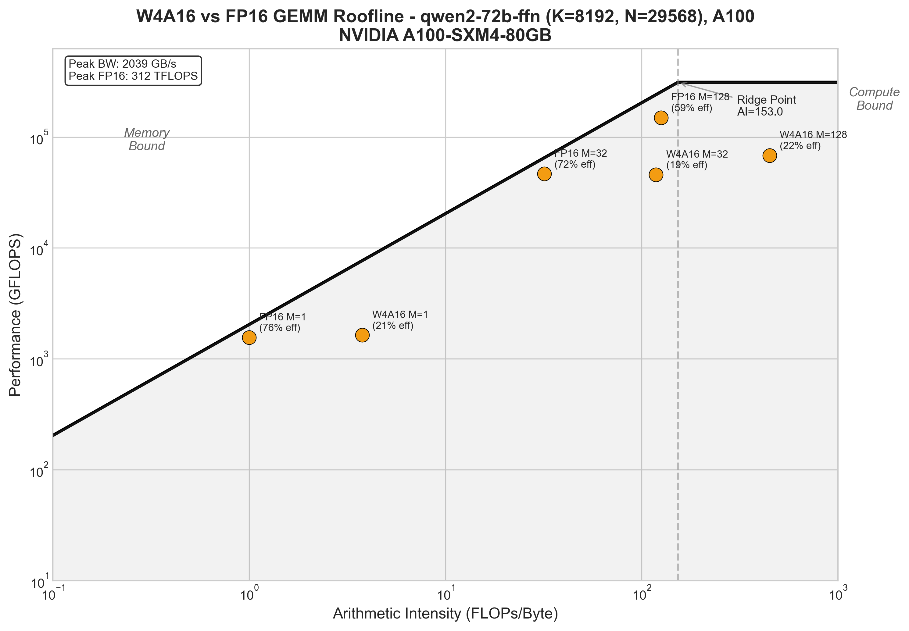

# W4A16 GEMM in Triton: Portable 4-bit Weight-Only Inference

## Overview

W4A16 is 4-bit weight-only quantized matrix multiply: FP16 activations times INT4
weights, with the weights dequantized inside the kernel. It is the dominant LLM
inference quantization in 2026 (GPTQ / AWQ), and the fast kernels for it (Marlin, AWQ,
exllama) are all CUDA-only and vendor-locked.

This is a portable Triton implementation that runs on NVIDIA and AMD (via the Triton
backend). The result: it **beats cuBLAS FP16 in the decode regime** (~1.05-1.17x at
batch size 1 on the large FFN shapes) via a split-K dispatch, and matches FP16 for
larger batches, with no vendor-specific code.

```
y = x @ dequant(W_q)
```

- `x`: FP16 activations, `(M, K)`
- `W_q`: INT4 weights, 8 nibbles packed per int32 along K -> `(K // 8, N)`
- per-group scale and zero-point along K -> `(K // group_size, N)`
- dequant: `w = (q - zero) * scale`

## Architecture

### Weight format

Weights are quantized to 4 bits (unsigned, values in `[0, 15]`) with one scale and one
zero-point per group of `group_size` rows along K (GPTQ / AWQ style, group_size 64 or
128). Eight nibbles are packed into one int32 along K. The unsigned + zero-point
representation covers both asymmetric (per-group zero-point) and symmetric (fixed
zero-point of 8) quantization.

### The kernel

A tiled GEMM with dequant fused into the K-loop, so weights cross the memory bus at
4 bits and are expanded to FP16 on chip only. FP16 tensor cores, FP32 accumulation.

### Key design decisions

1. **Load-once unpack.** Each packed int32 is loaded exactly once (a `(BLOCK_K // 8,
   BLOCK_N)` tile) and all 8 nibbles are unpacked in registers with a broadcast shift,
   then reshaped to the `(BLOCK_K, BLOCK_N)` weight tile. A naive kernel that indexes
   with `offs_k // 8` reloads each int32 8 times, moving ~8x the weight traffic and
   throwing away the 4-bit bandwidth advantage.
2. **Hoisted group scales.** `BLOCK_K` divides `group_size`, so each K-tile lies within
   one quantization group and loads a single scale/zero row, not a per-element tile.
3. **Split-K dispatch for decode.** A skinny (small-M) GEMM launches too few programs
   to saturate HBM, so the plain kernel loses to cuBLAS FP16 despite moving 4x less
   data. For `M <= 8` the kernel dispatches to a split-K variant that splits the K
   reduction across programs (FP32 atomic-add partials), restoring parallelism. For
   larger M the non-split kernel is faster.

## Benchmark Results

A100-SXM4-80GB, group_size 128, `triton.testing.do_bench`, vs `torch` FP16 (cuBLAS).
Speedup is W4A16 / FP16 (higher is better).

### qwen2-72b-ffn (K=8192, N=29568)

| M | W4A16 (ms) | FP16 (ms) | speedup |
|---|---|---|---|
| 1 | 0.296 | 0.311 | **1.05x** |
| 8 | 0.313 | 0.314 | 1.00x |
| 32 | 0.339 | 0.333 | 0.98x |
| 128 | 0.907 | 0.414 | 0.46x |

### llama3-8b-ffn-up (K=4096, N=14336)

| M | W4A16 (ms) | FP16 (ms) | speedup |
|---|---|---|---|
| 1 | 0.086 | 0.100 | **1.17x** |
| 8 | 0.094 | 0.099 | 1.05x |
| 32 | 0.148 | 0.099 | 0.66x |
| 128 | 0.253 | 0.122 | 0.48x |

W4A16 wins in the decode regime (small M) on the large FFN shapes that dominate a
model's weights, and cedes to FP16 as M grows into the compute-bound (prefill) regime.
It also carries a 4x weight-memory reduction at all M.

## Roofline Analysis



Because it moves 4x less weight data, W4A16 sits at ~4x the arithmetic intensity of FP16
at a given M (AI 3.8 vs 1.0 FLOP/byte at M=1). At decode, both kernels are far below the
compute ceiling (few programs, latency/parallelism bound); split-K lets W4A16 edge past
FP16 there. As M grows the operating point marches up the memory roofline and past the
ridge (AI 153) into the compute-bound region, where cuBLAS FP16's tensor-core
utilization pulls ahead (M=128: W4A16 68 TFLOPS vs FP16 150 TFLOPS).

Peak achieved weight-stream bandwidth is ~26% of the 2039 GB/s HBM peak. The remaining
gap to the ~4x roofline win is the int4 unpack + dequant + reshape overhead and
tensor-core feeding, which the full Marlin-style layout addresses (see Future Work).

## Correctness Validation

30/30 tests pass on A100 (`tests/test_w4a16.py`): the Triton kernel matches the PyTorch
reference (`reference/w4a16_reference.py`) at `rtol/atol=1e-2` across batch sizes (both
dispatch paths), group sizes 64 and 128, and symmetric + asymmetric quantization, plus
CPU tests for the pack/unpack and quantization utilities.

## Comparison vs the incumbents

- **cuBLAS FP16**: W4A16 beats it in decode on the large FFN shapes (~1.05-1.17x) and
  matches it for small-to-moderate M, while using 4x less weight memory. It loses at
  large M (prefill), where the workload is compute-bound.
- **Marlin (CUDA)**: not matched. Marlin's throughput comes from a bespoke permuted
  weight layout that feeds tensor cores without a runtime reshape, async `cp.async`
  pipelining, and a cheaper unpack. A simple-layout Triton kernel is not expected to
  match it; the win here is portability (runs on AMD) plus a real decode-regime speedup
  over FP16.

## Limitations and Future Work

- **Full Marlin-style layout** for the ~4x memory-bandwidth roofline win (permuted
  weights, async pipelining, reshape-free unpack). The large, uncertain follow-up.
- **Per-shape split-K tuning.** The fixed `SPLIT_K` heuristic runs a bit under the
  best-config sweep (up to ~1.28x measured); autotuning is awkward because of the
  atomic-add output.
- **AMD MI300X** correctness validation via the Triton ROCm backend (pending).
- **FP8 activations (W4A8)** and larger group-size flexibility.

## Reproducing Results

```bash
# Correctness (requires CUDA GPU)
pytest tests/test_w4a16.py -v

# Benchmark vs torch FP16
python benchmarks/bench_w4a16.py

# Roofline plot
python benchmarks/roofline/w4a16_roofline.py --shape qwen2-72b-ffn \
    --output docs/figures/w4a16_roofline.png
```
